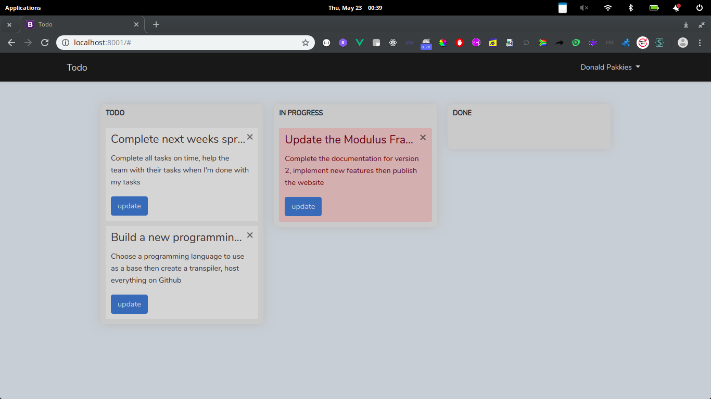

## Todo

<p align="center"></p>

### Requirements

* PHP 7.3.*
* Nodejs 11.0.0 (or > 6.*)
* NPM 6.5.0
* Apache2/Nginx
* MySQL

### Getting Started

First clone the application:

```bash
git clone https://github.com/CliffMathebula/todo-app.git
```

Install PHP dependencies:

```bash
composer install
```

Install JavaScript dependencies (Optional):

> Run only if you would like to make changes to the front-end

```bash
npm install
```

Rename `.env.example` to `.env` then set the app key by running the following command:

```bash
php artisan key:generate --ansi
```

Create a new Database and configure it in the `.env` then run the `migrate` command:

```bash
php artisan migrate
```

Add a cronjob

```bash
* * * * * php /todo-app-path/artisan schedule:run >> /dev/null 2>&1
```

Run the application!

```bash
php artisan serve
```

> Don't forget to configure the default email account in the `.env` file.

## License

This Todo application is a open-source software licensed under the [MIT license](https://opensource.org/licenses/MIT).
